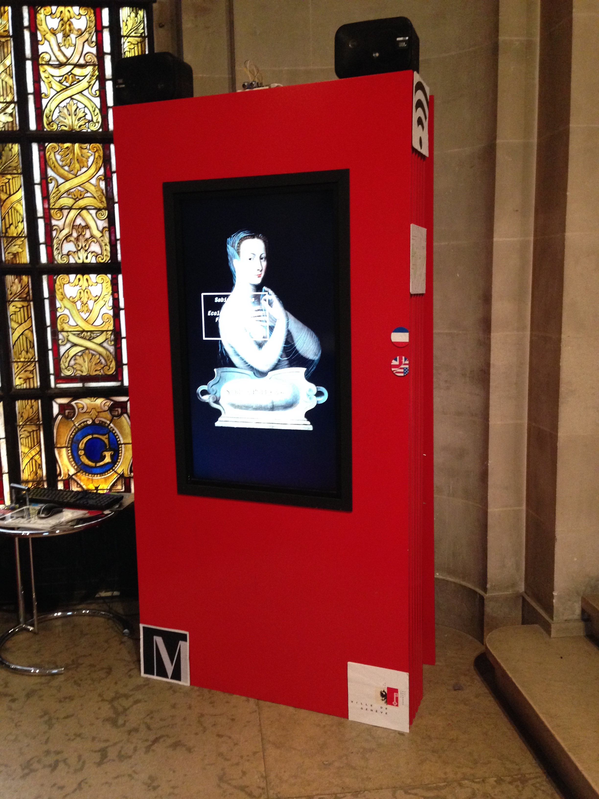

# Les insomniaques du musée

Ce référentiel contient une description technique, ainsi que le code source des composants logiciels, de l'installation [‹Les insomniaques du musée›](http://www.museomix.org/prototypes/les-insomniaquesdumusee/), réalisée par l'équipe 6 pendant les trois jours de [Museomix Léman 2014](http://leman.museomix.ch/), sur le thème ‹Comment faire vivre le musée dans la cité?›.

   

## Présentation

[Fiche de présentation du prototype](http://www.museomix.org/prototypes/les-insomniaquesdumusee/), sur le site Museomix. Extrait du pitch de présentation: 

« A la tombée de la nuit, les oeuvres du musée d'art et d'histoire s'invitent dans la cité et s'animent. Elles ont terminé leur journée, quittent leur support et réapparaissent, lumineuses, à la nuit tombante sur des panneaux disposés en ville qui ressemblaient à des affiches jusque-là. \[…\] »

## Matériel et assemblage

Sources et instructions d'assemblage:

* [Animation principale](code/animation) _Sources MaxMSP du contrôleur du dispositif et instructions de déploiement_
* [Détecteur de présence](code/detecteur-presence) _Sources Arduino et instructions d'assemblage du détecteur_
* [Boutons capacitifs](code/boutons-capacitifs) _Instructions d'assemblage des boutons capacitifs_

L'installation est un assemblage des éléments matériels suivants:

* un coffre en bois laqué rouge, avec un panneau arrière amovible;
* dans lequel était inscrusté un écran plat [Sony 42" Flat Wide Display; Monitor](http://www.sony.fr/pro/product/professional-displays-public-displays/fwd-s42h1/) (M/N FWD-S42H1);
* sur lequel était disposé un [détecteur de présence](code/detecteur-presence), réalisé avec un Arduino et un détecteur à ultrasons;
* deux [boutons capacitifs](code/boutons-capacitifs) en façade, pour la bascule entre la langue anglaise et française;
* un [bouton capacitif](code/boutons-capacitifs) à l'arrière, pour la bascule manuelle entre les modes jour et nuit;
* et à l'intérieur duquel se trouvait un Mac Mini, qui pilotait une [animation MaxMSP](code/animation), réagissant aux boutons et au détecteur de présence;
* un contrôleur [Ototo](http://www.ototo.fm/products), connecté aux boutons capacitifs;
* ainsi qu'un amplificateur audio [Cambridge Audio One](http://www.cambridgeaudio.com/node/1828) 2x 30W
* raccordé à deux enceintes audio [JBL Control One](http://fr.jbl.com/jbl_product_detail_de/control-one.html).

Nous avions envisagé d'incruster les enceintes dans le pied de l'installation, mais comme il n'était pas possible d'altérer le coffre en bois, elles ont été disposées dessus (comme figuré sur les photos).
 
## Equipe de réalisation

### Equipe 6

* Anne Zumbach _communication_
* Stéphanie Masuy _méditation culturelle_
* Marie-Hélène de Ryckel _méditation culturelle_
* Karl Laurent _contenus muséaux_
* Vincent de Vevey _graphisme_
* Olivier Lange _codeur_
* Eric Brachet _facilitateur_

### Avec le soutien de

* Jérémie Forge [Hemisphere Project](http://www.hemisphere-project.com) _guichet des technologies_
* Alain Barthélémy [Hemisphere Project](http://www.hemisphere-project.com) _guichet des technologies_
* Richard Timsit [FabLab Renens](http://www.fablab-chene20.ch/) _découpe laser_
* Paola [Webster University](http://www.webster.ch) _photo, captation et montage vidéo_
* Eric [Webster University](http://www.webster.ch) _photo, captation et montage vidéo_

### Remerciements

* Gregor Bruhin [FabLab La Côte](http://www.fablab-lacote.ch) _coup de main complice pour installer le pilote Arduino_
* Patrick Condevaux _qui nous a suggéré d'utiliser le board [Ototo](https://www.kickstarter.com/projects/905018498/ototo-make-music-from-anything) pour les boutons capacitifs_
* Luca Palli _suggestions de matériel et indéfectible soutien logistique_

## Licence

 Les sources du prototype [Les insomniaques du Musée](http://www.museomix.org/prototypes/les-insomniaquesdumusee/) de l'équipe 6 de [Museomix Leman 2014](http://www.museomix.org/localisation/geneve-2014/) sont mis à disposition selon les termes de la licence [Creative Commons Attribution – Partage dans les Mêmes Conditions 4.0 International](http://creativecommons.org/licenses/by-sa/4.0/).
