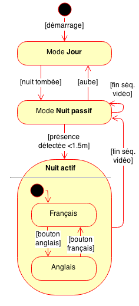

# Animation MaxMSP

Le coeur de l'installation est une animation interactive réalisée avec [MaxMSP](https://cycling74.com/products/max/) par Jérémie Forge ([Atelier Hemisphère](http://www.hemisphere-project.com/)), de l'équipe du Guichet des Technologies de Museomix Léman 2014.

   

## Présentation

### Etats

Cette animation possède 3 états:

* un mode **jour**, dans lequel l'installation présente une oeuvre du musée, immobile, silencieuse, avec des indications sur l'exposition en cours au musée (séquence vidéo [wait_day.mov](https://docs.google.com/file/d/0B6MJiDb9PY-7dF9BYVZyank3Sms/edit), voir ci-après); elle est semblable à une affiche imprimée;
* un mode **nuit passif**, où elle est en attente et présente une oeuvre du musée dans une animation silencieuse, énigmatique, qui invite les passants à la curiosité (séquence vidéo [wait_night.mov](https://docs.google.com/file/d/0B6MJiDb9PY-7WmdQRHFVMVdBVXc/edit));
* un mode **nuit actif**, déclenché lorsqu'un·e passant·e s'approche à moins de 1.50 m du dispositif, dans lequel l'oeuvre prend vie, s'anime et interpelle ce·tte passant·e.

Elle possède 2 états internes à ce dernier état **nuit actif**:

* séquence vidéo en **français** (séquence vidéo [scenario_FR.mov](https://docs.google.com/file/d/0B6MJiDb9PY-7Z0lDWEJPc0hSZWs/edit))
* séquence vidéo en **anglais** ([scenario_EN.mov](https://docs.google.com/file/d/0B6MJiDb9PY-7TVhrOXd5UERKMXc/edit)).

### Transitions entre les états

* l'animation passe de l'état **jour** à l'état **nuit passif**, lorsque l'on effleure le bouton capacitif servant à déclencher cette transition; dans une version définitive, cette transition se déclencherait automatiquement, à la nuit tombée;
* elle passe des états **nuit passif** et **nuit actif** à l'état **jour**, lorsque l'on effleure à nouveau le bouton capacitif qui permet cette bascule; dans une version définitive, cette transition se déclencherait automatiquement, lorsque le soleil réapparaît;
* elle passe de l'état **nuit passif** à l'état **nuit actif**, lorsque le dispositif détecte une présence à une distance de moins de 1.50 m;
* lorsque l'animation est dans l'état **nuit actif**, il est possible de basculer entre deux états internes, **français** et **anglais**, en effleurant les deux boutons capacitifs en façade, qui permettent le choix de la langue;
* à la fin de la lecture de la séquence vidéo de l'état **nuit actif**, le dispositif retourne automatiquement au mode **nuit passif**.

### Les séquences vidéo

Sont disponibles dans le dossier [Google Drive de Museomix Leman](https://drive.google.com/drive/#folders/0B3Q4jqRazJwDd2FEOXFWeWNHVGM/0B6MJiDb9PY-7Q19Ic3F2a3VLZms/0B6MJiDb9PY-7OVRnQWZlX2FnaDA):

|Etat|Fichier|Taille|Durée|Description|
|----|-------|:----:|:---:|-----------|
|Jour|[wait_day.mov](https://docs.google.com/file/d/0B6MJiDb9PY-7dF9BYVZyank3Sms/edit)|24MB|1 sec, en pause|Animation silencieuse, présentant le portrait immobile de [Sabina Poppea](http://fr.wikipedia.org/wiki/Poppée), une oeuvre du musée, avec des indications sur l'exposition en cours au musée; l'animation ne se distingue presque pas d'une affiche lumineuse|
|Nuit passif|[wait_night.mov](https://docs.google.com/file/d/0B6MJiDb9PY-7WmdQRHFVMVdBVXc/edit)|866MB|1 min, en boucle|Le même portrait en négatif, sur fond de voûte étoilée qui tourne lentement, énigmatique, qui invite à la curiosité|
|Nuit actif / FR|[scenario_FR.mov](https://docs.google.com/file/d/0B6MJiDb9PY-7Z0lDWEJPc0hSZWs/edit)|313MB|36 sec, passage unique|L'oeuvre s'anime et interpelle le·la passant·e, en français; elle se présente, troublante, cligne de l'oeil et l'engage à la rejoindre au musée|
|Nuit actif / EN|[scenario_EN.mov](https://docs.google.com/file/d/0B6MJiDb9PY-7TVhrOXd5UERKMXc/edit)|313MB|36 sec, passage unique|La même animation, avec le commentaire en anglais|

### Note 

Les séquences présentes dans ce référentiel GitHub sont des vidéos d'exemple de taille réduite, qui étaient utilisées pendant le développement, mais ne correspondent pas à celles du dispositif présenté. GitHub restreint en effet la [taille max. des fichiers à 100MB](https://help.github.com/articles/what-is-my-disk-quota/) et la [taille du référentiel à 1GB](https://help.github.com/articles/what-is-my-disk-quota/); comme ces limites sont dépassées par nos fichiers vidéo, elles ont été placées sur Google Drive.
