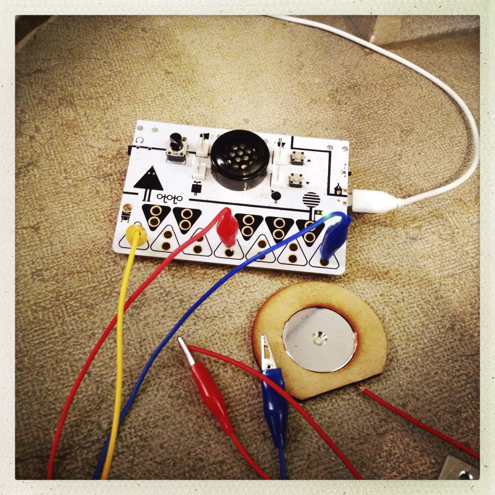
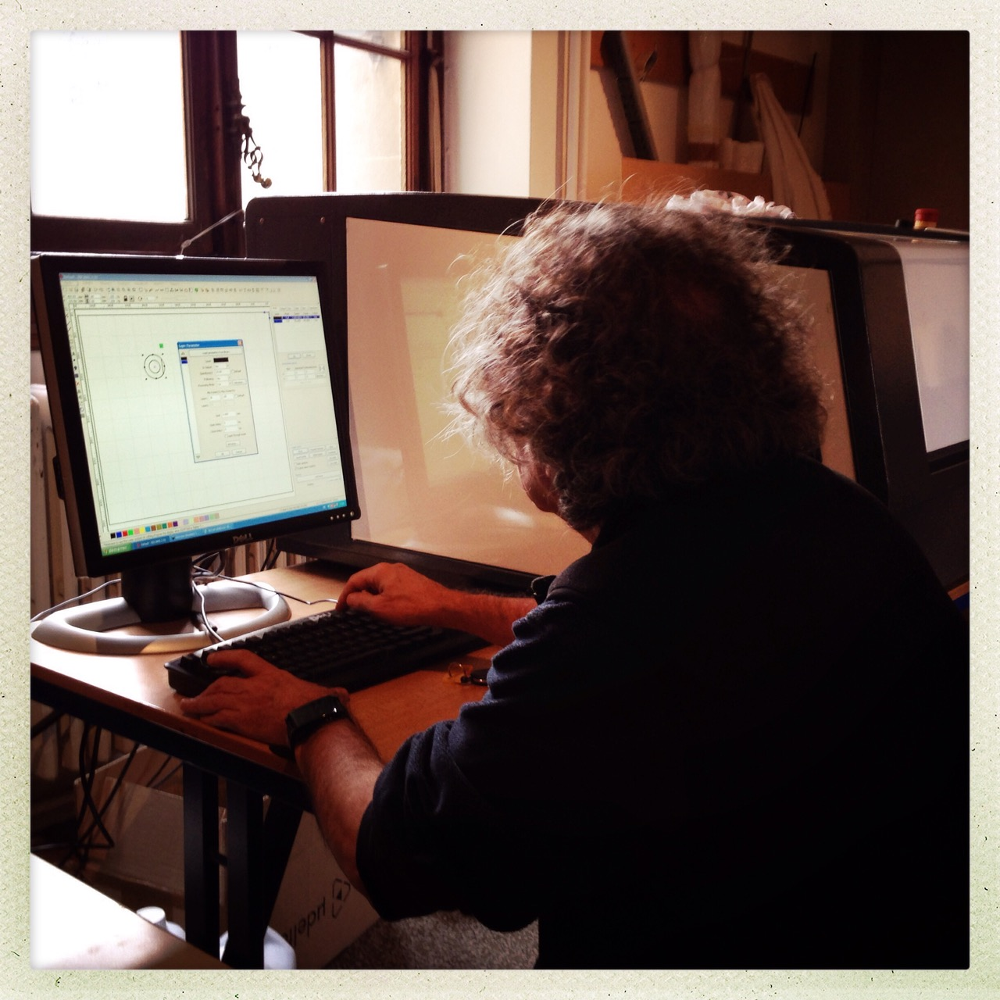
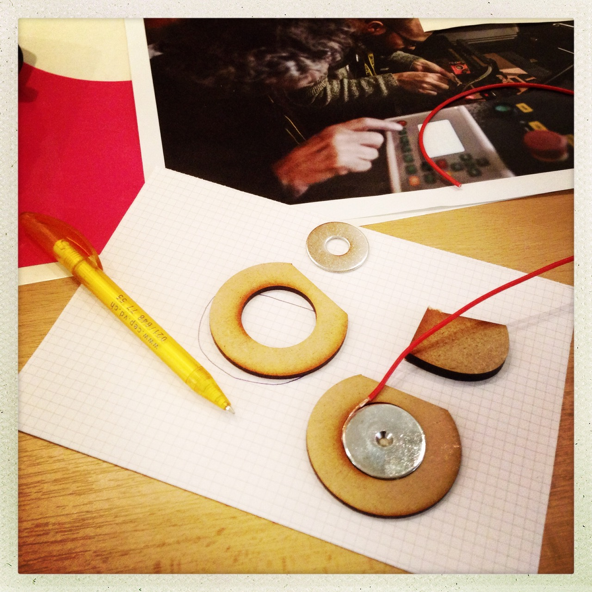
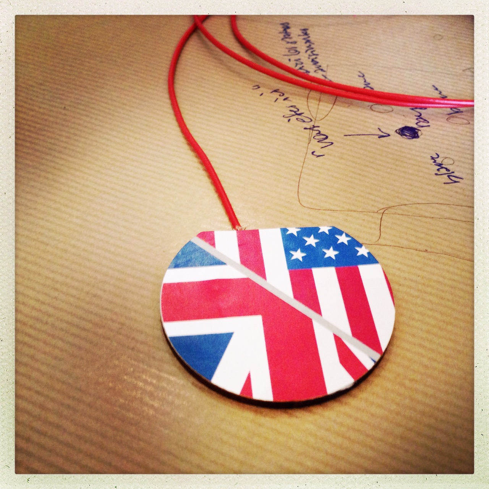
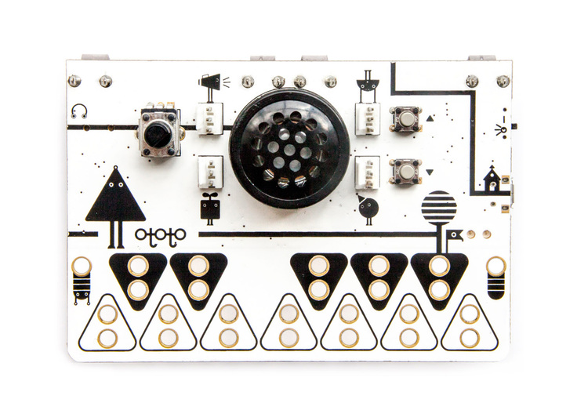
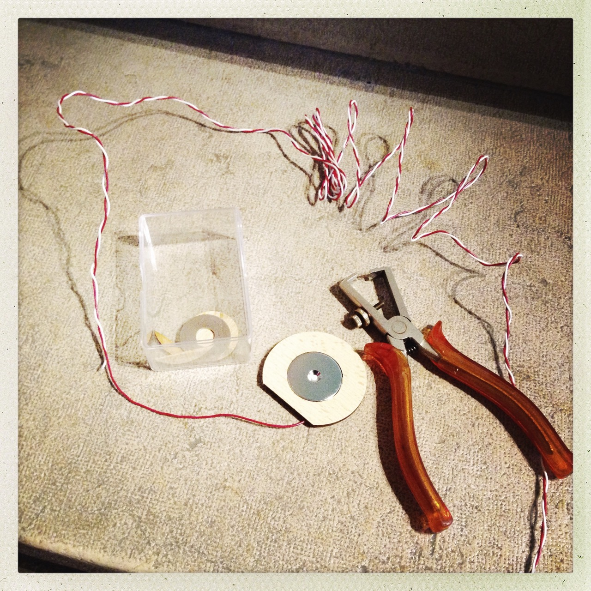
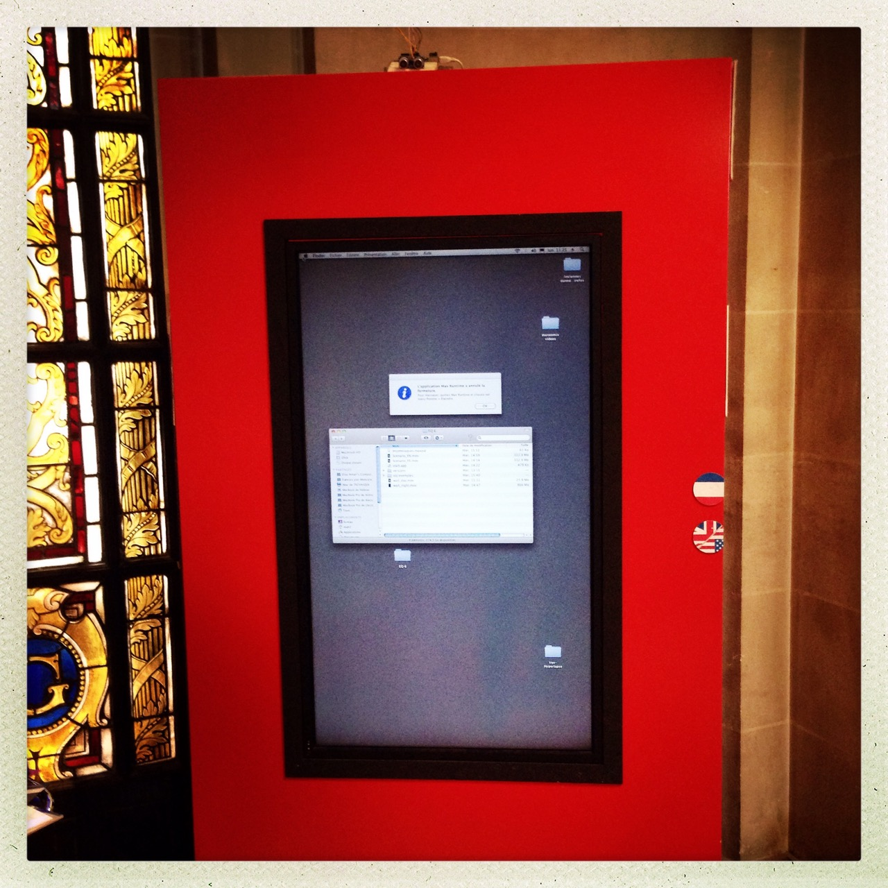
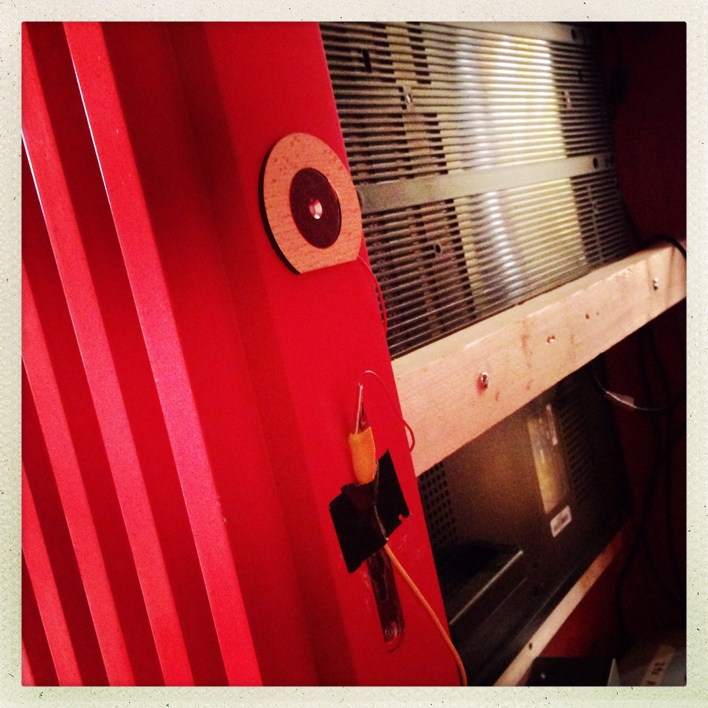

# Boutons capacitifs

Pour permettre de basculer la langue de l'anglais au français en façade du coffre en bois,
nous avons imaginé des boutons capacitifs, collés à l'aide de scotch double face, qui réagissent
à un simple effleurement. Nous avions pour contrainte qu'il ne fallait pas altérer la laque
et peinture rouge du coffre en bois.

## Principe

L'effleurement est détecté par le sympathique [circuit Ototo](http://www.ototo.fm/products),
qui mesure l'altération de la capacitance sur son bornier. Il livre des signaux Midi sur un
câble USB, qui étaient capturés par [l'animation MaxMSP](../animation/README.md).

## Construction 

Chaque bouton était un assemblage:

* d'un anneau en bois de 3mm d'épaisseur, obtenu par découpe laser;
* d'une rondelle en métal autocollante, sertie dans l'anneau en bois;
* d'un fil de cuivre de 0.75mm, coincé entre l'anneau en bois et la rondelle en métal;
* le tout encollé de morceaux de papier, découpés au ciseau, arborant les drapeaux correspondant aux
langues.

## Alternatives

Sans doute aurait-il été plus simple de réaliser ces trois boutons avec des composants
prêts à l'emploi avec un cicuit Arduino – tels qu'un [SparkFun Capacitive Touch Sensor Breakout](https://www.sparkfun.com/products/9695)
ou [SparkFun Capacitive Touch Breakout](https://www.sparkfun.com/products/12041).
Nous n'avions cependant pas ces composants à disposition au magasin de Museomix. 
