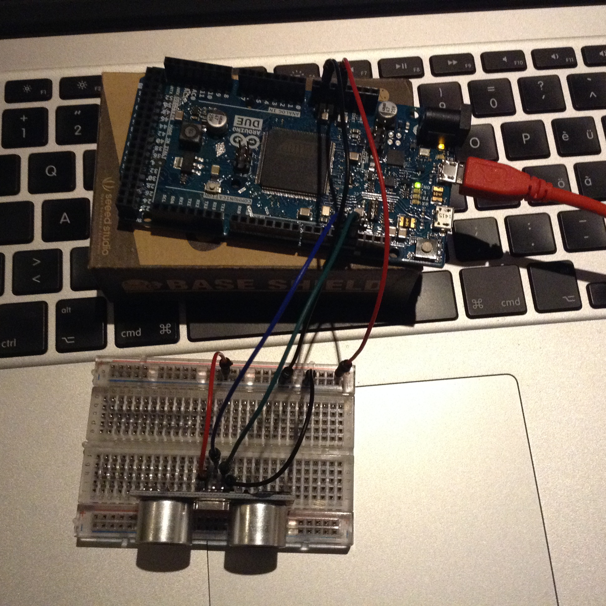
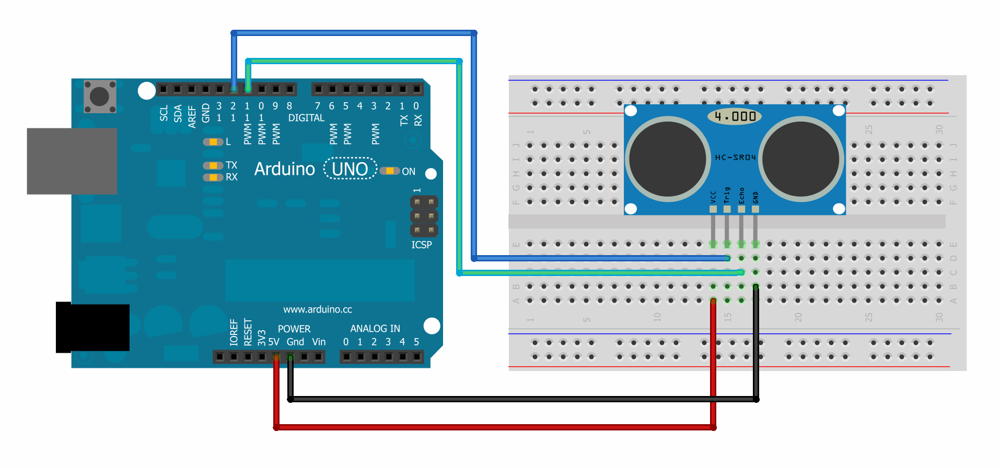
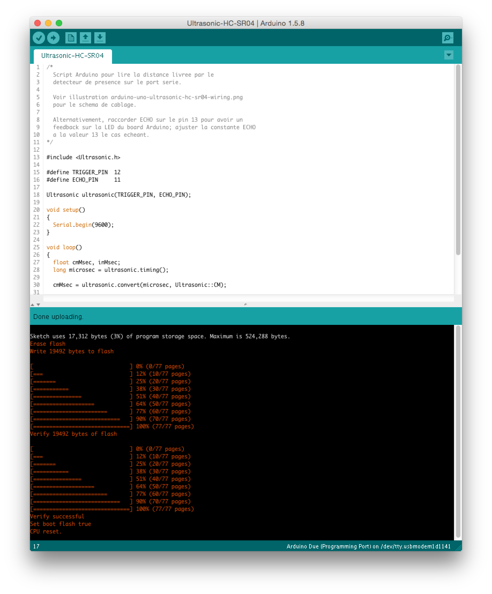
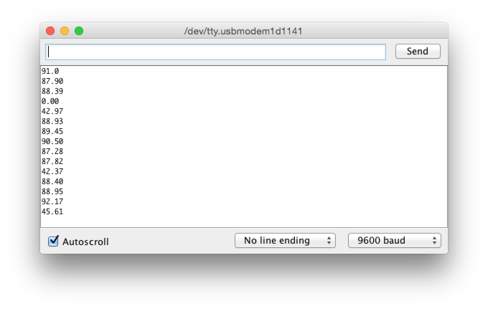

# Détecteur de présence

Ce dossier contient les sources du programme Arduino du détecteur de présence, réalisé
par Jérémie Forge et Alain Barthélémy, l'équipe du _Guichet des Technologies_ de Museomix Léman 2014.

L'assemblage original a été réalisé avec un circuit [Arduino Uno](http://arduino.cc/en/Main/ArduinoBoardUno) et le schéma de câblage est donné pour ce dernier. Il peut cependant être réalisé avec d'autres circuits Arduino. Par exemple, avec le circuit [Arduino Due](http://arduino.cc/en/Main/ArduinoBoardDue) (cf. photo ci-dessus).

## Préparation

### Matériel

 * Circuit [Arduino Uno](http://arduino.cc/en/Main/ArduinoBoardUno)
 * ou circuit [Arduino Due](http://arduino.cc/en/Main/ArduinoBoardDue)
 * Capteur [Ultrasonic HC-SR04](https://docs.google.com/document/d/1Y-yZnNhMYy7rwhAgyL_pfa39RsB-x2qR4vP8saG73rE)
 * Breadboard et câbles
 * Câble USB/microUSB pour programmer l'Arduino

### Logiciel

 * Télécharger et installer l'[IDE Arduino 1.0](http://arduino.cc/en/Main/Software) pour le circuit _Arduino Uno_
 * ou l'[IDE Arduino 1.5.8 beta](http://arduino.cc/en/Main/Software) si vous utilisez un circuit _Arduino Due_

### Librairie Ultrasonic

La librairie Ultrasonic HC-SR04 pour Arduino est requise pour pouvoir compiler le programme du détecteur.
Placer une copie de celle-ci dans le dossier des [librairies de l'IDE Arduino](http://www.arduino.cc/en/Hacking/Libraries).

Voici des instructions pour Mac OS X; le dossier cible des librairies est `~/Documents/Arduino/libraries/`:

    $ cd code/detecteur-presence/
    $ git submodule update --init
    $ cd ArduinoLibraries/HCSR04Ultrasonic
    $ mkdir ~/Documents/Arduino/libraries/Ultrasonic
    $ cp Ultrasonic.{cpp,h} ~/Documents/Arduino/libraries/Ultrasonic/

Le code source de la librairie Ultrasonic se trouve dans le sous-dossier `ArduinoLibraries/HCSR04Ultrasonic`
— ce dernier étant lié au référentiel externe [daijo/ArduinoLibraries](https://github.com/daijo/ArduinoLibraries)
par le mécanisme de [sous-modules](http://git-scm.com/book/en/v2/Git-Tools-Submodules) de Git.

## Assemblage

Voici comment raccorder le détecteur Ultrasonic au circuit Arduino Uno (source: https://code.google.com/p/arduino-new-ping):

Le câblage est similaire pour raccorder le détecteur au circuit Arduino Due. Veiller à utiliser le pin VCC +5V du circuit de l'Arduino pour alimenter le détecteur, qui requiert +5V pour fonctionner.

## Compilation

Raccorder l'assemblage à l'ordinateur par le câble USB (connecter le port _Programming_ sur l'Arduino Due) et lancer l'IDE Arduino.

Ouvrir le fichier `Ultrasonic-HC-SR04/Ultrasonic-HC-SR04.ino`, sélectionner le board adéquat (menu _Tools » Board_)
et le port (menu _Tools » Port_) adéquats, puis commander l'upload du programme (menu _File » Upload_).

Puis ouvrir le moniteur du port série (menu _Tools » Serial Monitor_). Lorsque le dispositif fonctionne, on peut y lire la distance d'un objet au détecteur, exprimée en centimètres.

